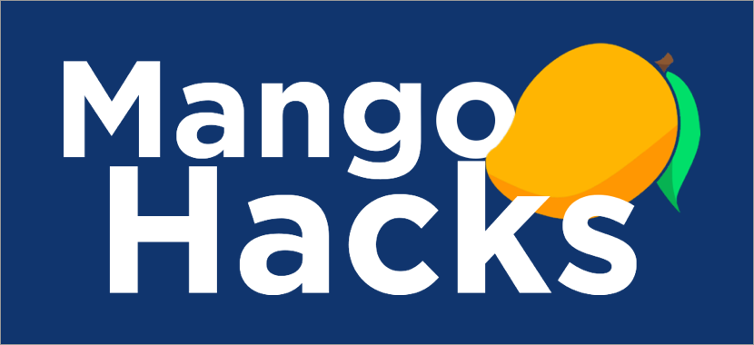

# MangoHacksReactChat
---
> Boilerplate For Mango Chat Application

---

This repository contains the boilerplate code for a workshop that I am having
during FIU's MangoHacks 2016 Hackathon.

### Prerequisites for Getting Started

+ <h4> [NodeJS](https://nodejs.org/en/) </h4>
+ <h4> [Git](https://git-scm.com/downloads) </h4>
+ <h4> [Webpack](https://webpack.github.io/) `npm install webpack -g` </h4>

# Happy Hacking!
